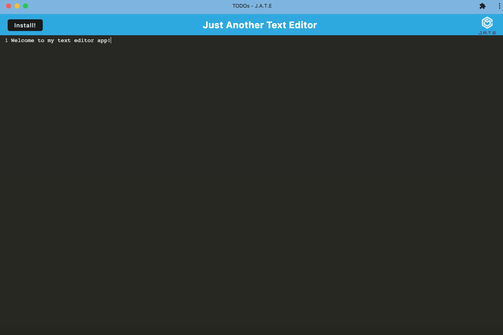

# text-editor-app

## This app was created in order to allow devs to have a text editor that they can use both online and offline. By working on this app, i was able to utilize service workers, caches and a indexed database via javascript.

## Links

- Repository URL: https://github.com/bburton5/text-editor-app
- Deployed Application URL: https://cryptic-wildwood-34775.herokuapp.com/

## Usage

## Credits

- StackOverflow
- MDN
- w3schools
